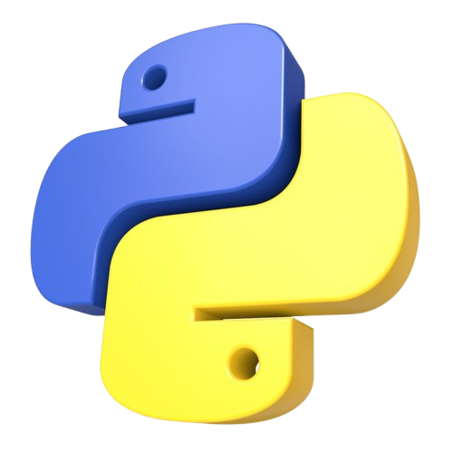

# Selamat Datang di Modul Belajar Python Delta_Code.id

> *“Belajar Python, biar hidupmu gak cuma error tapi bisa nge-debug masa depan 😎”*

---

{ width="30%" }

---

## 🚀 Tentang Proyek Ini

Halo! Ini adalah seri dokumentasi belajar Python khusus buat kamu yang:

- Baru mulai ngoding
- Penasaran sama Python tapi gak tahu mulai dari mana
- Suka belajar step-by-step, dari dasar sampai expert

Disusun dengan ❤️ oleh **Marno**, Mahasiswa TI sekaligus pejuang sawit sejati 🌴💻

---

## 📚 Daftar Isi Modul

Kamu bisa langsung klik salah satu modul di sidebar atau pilih dari daftar di bawah:

- [Modul 1 - Pengenalan Python](modul1.md)
- [Modul 2 - Variabel dan Tipe Data](modul2.md)
- [Modul 3 - Operasi Dasar](modul3.md)
- [Modul 4 - Percabangan](modul4.md)
- [Modul 5 - Perulangan](modul5.md)
- *(lanjut sampai Modul 30 ya capek juga ngetiknya manual 🤣)*

---

## 🤯 Kutipan Random Buat Semangat

> *“Programmer itu kayak petani sawit. Panen hasilnya butuh sabar, tapi begitu dapet, rasanya manis juga.”* — Anak TI Galau

> *“Kalau kamu gagal debug, bukan salah Python. Mungkin kamu ngoding sambil nahan ngantuk.”* — Marno, 2025

> *“Error itu bukan akhir. Itu cuma Python ngajak diskusi.”*

---

## ✨ Powered by

- [DELTA_CODE.ID](delta.code.id)
- [Python](https://www.python.org/)
- [MkDocs](https://www.mkdocs.org/)
- [Material for MkDocs](https://squidfunk.github.io/mkdocs-material/)
